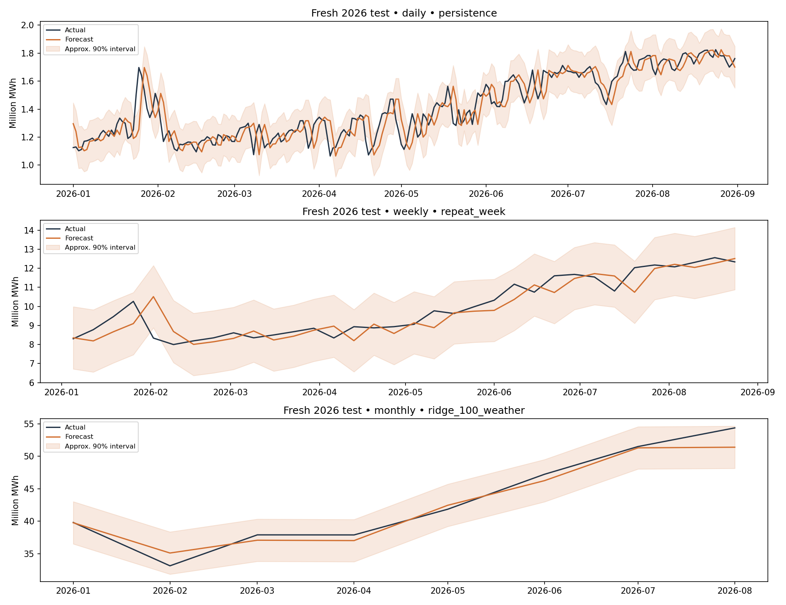

# Electricity Demand Forecasting with Python and SQL

A portfolio case study in forecasting ERCOT electricity demand at daily, weekly and monthly scales. The project combines SQL data checks, time-aware model selection, baseline comparisons and reproducible local inference.

**Main finding:** Forecasting methods performed differently by scale. Persistence was selected for daily demand, repeat-week for weekly demand, and ridge regression with weather proxies for monthly demand. On the January–August 2026 test, the monthly model reduced mean absolute error by **57.7%** against repeat-week, across **eight monthly observations**. The weekly product did not meet the proposed improvement threshold.

**Tools:** Python · pandas · NumPy · SQLite · scikit-learn · Matplotlib · Jupyter

## Review the project

- [Portfolio case study](docs/PORTFOLIO_CASE_STUDY.md): problem, approach, results and limitations.
- [Executed methodology notebook](notebooks/01_complete_data_science_methodology.ipynb): the complete analysis and modeling workflow.
- [Management brief](reports/v2/management_brief.md): decision-facing findings.
- [Forecasting code](scripts/forecast_core.py) and [behavioral verification](scripts/verify_lifecycle.py): implementation and checks.

For a shorter learning exercise, use the [beginner notebook](notebooks/00_beginner_energy_forecasting.ipynb) and [beginner plan](docs/BEGINNER_PLAN.md). Its January 2025 results are separate from the main study.

## Business problem and success criteria

Estimate next-day, next-calendar-week and next-calendar-month electricity demand in MWh. This supports energy-volume planning; it does not establish hourly peak-capacity accuracy or financial savings. Proposed portfolio gates are ≥10% lower MAE than repeat-week and absolute bias <3%. No real stakeholder has approved these thresholds.

## Fresh January–August 2026 results

| Product | Selected method | WAPE | MAE improvement vs repeat-week | Proposed accuracy gate |
|---|---|---:|---:|---|
| Daily | Persistence | 5.26% | 23.0% | Pass |
| Weekly | Repeat-week | 4.85% | 0.0% | Review |
| Monthly | Ridge + weather proxies | 2.46% | 57.7% | Pass |

Models were selected on expanding 2022/2023 validation folds, not on these scores. Baselines were eligible and won two products. Weather reduced monthly MAE by 5.3% in the paired alpha-100 ridge comparison, but did not improve that estimator's daily or weekly results. The model portfolio therefore differs by scale.

The weekly improvement gate failed. Only eight monthly test observations are available. These findings justify a local prototype and further evaluation, not an operational deployment claim.



## Six completed methodology phases

| Phase | Work performed | Main evidence |
|---|---|---|
| Business understanding | Stakeholder assumptions, decision, units, hypotheses, success criteria | [Protocol](docs/EXPERIMENT_PROTOCOL_V2.md) |
| Data understanding | Provenance, SQL joins, missingness, schema, distributions, seasonality, revisions | [Dictionary](docs/DATA_DICTIONARY.md), reports/v2/data_profile.csv |
| Data preparation | Calendar spine, cleaning log, preserved unknown targets, outlier flags, training-only preprocessing | [SQL](sql/lifecycle_v2.sql), [data code](scripts/lifecycle_data.py) |
| Modeling | Two baselines, six candidate configurations, expanding folds, frozen selections | [Forecasting functions](scripts/forecast_core.py), reports/v2/candidate_ranking.csv |
| Evaluation | Fresh test, residuals, weather ablations, uncertainty, lead-time checks, stability analysis | reports/v2/management_scorecard.csv, [brief](reports/v2/management_brief.md) |
| Delivery and monitoring | Saved artifact, inference CLI, input rejection, forecast outputs, retrospective monitoring | [Model card](docs/MODEL_CARD.md), [handoff](docs/MONITORING_AND_HANDOFF.md) |

## Data

EIA ERCO daily demand from [EIA's daily regional endpoint](https://www.eia.gov/opendata/browser/electricity/rto/daily-region-data), with daily ERA5 weather for Houston, Dallas, Austin and San Antonio from [Open-Meteo](https://open-meteo.com/en/docs/historical-weather-api). Credit Open-Meteo and Copernicus/ECMWF ERA5. Dates: January 2019–August 2026; 2,800 calendar days, 2,799 demand observations. December 5, 2025 remains missing. Retrieved September 28, 2026.

Raw JSON is preserved in data/raw/v2; curated daily data is data/processed/daily_v2.csv; normalized SQLite tables are data/energy_v2.sqlite. Data hashes and overlap revisions are recorded. Exact day-boundary semantics, source vintages and operational release delays still require validation.

## Time-aware experiment

1. Development folds: train through 2021 → validate 2022; train through 2022 → validate 2023.
2. Freeze each scale's model using average fold MAE relative to repeat-week.
3. Refit through 2023 and check 2024 without changing the selection.
4. Refit through 2024; use previously inspected 2025 for interval calibration.
5. Refit through 2025; open fresh January–August 2026 evaluation.
6. After evaluation, refit selected models through August 2026 for a dated local demonstration.

Inputs use demand through issue−1 and weather through issue−7. Calendar features are known; weather climatology is training-fitted. No realized target weather is used. Weekly/monthly totals come from one issue date before the period, never from stitched next-day forecasts. Missing actuals invalidate containing totals.

## Quick start

```sh
git clone https://github.com/kalebmyom2-eng/energy-demand-forecasting.git
cd energy-demand-forecasting
python -m venv .venv
source .venv/bin/activate
# Windows PowerShell: .venv\Scripts\Activate.ps1
python -m pip install -r requirements-notebooks.txt
python -m pip install jupyterlab
python -m jupyterlab notebooks/01_complete_data_science_methodology.ipynb
```

Run notebook cells in order. The beginner model uses an assumed average January temperature; in this one-month exercise, linear regression MAE was **305,335 MWh**, compared with **236,550 MWh** for the repeat-week baseline. The baseline performed better. These beginner results are separate from the advanced study above.

## Repository guide

| Folder | Contents |
|---|---|
| `notebooks/` | Beginner notebook, complete methodology, earlier walkthrough |
| `scripts/` | Data preparation, model fitting, prediction and verification |
| `sql/` | Data quality and analysis queries |
| `data/` | Public-source snapshots, prepared tables and SQLite databases |
| `reports/` | Metrics, charts and conclusions; `v2/` is the advanced study |
| `docs/` | Learning plan, experiment protocol, data dictionary and model card |
| `models/` | Small local model artifact used by the prediction demo |

See [data provenance and reuse](data/README.md). Only load serialized model artifacts from a source you trust.

## Reproduce in the terminal

Use Python 3.13 (the verified version). Run commands from the repository root. No database server or API credentials are needed for the included snapshots.

```sh
# Install the scientific stack in your chosen environment if it is not already present.
python -m pip install -r requirements.txt

# Execute all six phases with visible stage messages and a saved transcript.
set -o pipefail
python -u scripts/run_lifecycle.py 2>&1 | tee reports/v2/terminal_run.log

# Demonstrate historical-snapshot inference from the saved model, without retraining.
python scripts/predict.py --origin 2026-08-31

# Check actual behavior: leakage resistance, period accounting, selections and inference.
python scripts/verify_lifecycle.py
```

Optional notebook tools are listed in requirements-notebooks.txt. The notebook executes the same pipeline blocks, including model fitting, and has been run in order. Running the command above creates a local terminal transcript; machine-specific logs are excluded from Git.

```sh
# Optional refresh only: replaces the v2 source snapshots and can change later results.
# Public EIA DEMO_KEY quota limits apply; no personal credentials are committed.
sh scripts/download_v2.sh
```

## Delivery boundaries

models/v2/forecast_bundle.joblib contains trusted local models, preprocessing and climate references. September 2026 files in reports/v2/inference_demo are a historical forecast from August 31, not a current forecast. Their 31-day path includes a partial October period. Coherent totals of one daily path are distinct from independently selected weekly/monthly products. Partial periods are labeled; selected products follow their evaluated issue schedules.

Monitoring is a retrospective simulation, not a running service. See the model card for limitations and the handoff document for review actions and ownership requirements. A subsequent redesign needs another untouched test period.

## Earlier experiment

Version 1 files remain available for traceability, including [its README](README_v1.md) and review notebook. Its 2025 results are historical development evidence and are superseded by the revised protocol and new final test above.
