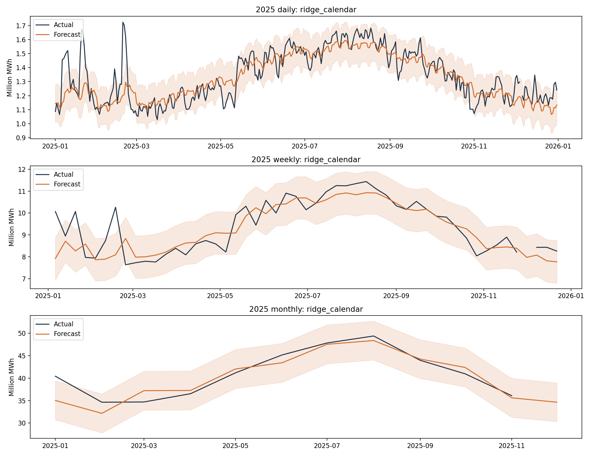

# ERCOT demand forecasting — management brief

Business question: can calendar, recent demand, and weather improve energy-volume planning against a repeat-week baseline?

## Independent 2025 test

| Delivery period | Selected model | WAPE | MAE improvement vs baseline | Approx. 90% interval coverage |
|---|---|---:|---:|---:|
| daily | ridge_calendar | 5.26% | 31.8% | 89.6% |
| monthly | ridge_calendar | 3.82% | 33.0% | 90.9% |
| weekly | ridge_calendar | 4.94% | 22.8% | 92.0% |

Selections were frozen using 2024 validation MAE. WAPE is total absolute error divided by total observed demand. Positive improvement means lower MAE than the baseline.

## What weather added

Past weather and seasonal weather averages did not beat the selected regression. Adding these features to the tree model improved validation performance but worsened test performance, so this specification has not demonstrated a reliable weather benefit. The realized-future-weather diagnostic reached 4.11% daily WAPE; it cannot be used as an operational score.

The largest next-day miss was February 19, 2025: actual demand was 1,724,708 MWh against a forecast of approximately 1,202,444 MWh. Strong average performance does not remove the risk of missing sharp demand spikes.

## Recommendation and limits

Use the selected models as portfolio planning prototypes. Performance is retrospective, not a verified live-service result. Report daily, weekly, and monthly quality separately; do not translate energy accuracy into financial savings without a cost model.

- Daily = next day; weekly = next complete Monday–Sunday issued Sunday; monthly = next calendar month issued on the preceding month end. Only periods entirely in the evaluation year are scored.
- December 5, 2025 has missing demand. It is not imputed for scoring; the affected weekly and monthly totals are excluded.
- Forecast features use demand and past weather through issue date minus one day. Actual operational reporting delays and weather release vintages need verification.
- The weather candidate uses past weather plus training-period seasonal weather means. The oracle diagnostic uses realized target weather and is never eligible for deployment or selection.
- Reanalysis weather and revised demand snapshots are not archived as-of feeds. City averages are spatial proxies. EIA Central and America/Chicago date labels are aligned, but exact daylight-saving aggregation semantics remain unverified.
- Interval calibration assumes reasonably stable residual behavior. Time dependence and only twelve monthly calibration periods limit reliability; inspect measured coverage.
- Independent best-model selections by output scale do not impose reconciliation. The January 2026 demonstration instead aggregates one daily path, so its totals reconcile; its multi-day accuracy is not the next-day score.
- The January 2026 files are a forecast from the historical dataset boundary, not a current September 2026 forecast.
- Federal holidays are a proxy for the operating calendar. Extreme events, outages, and demand growth can shift relationships.

## Next operational step

Acquire archived weather forecasts and demand vintages, verify time boundaries, and repeat rolling-origin evaluation before any operational use.

